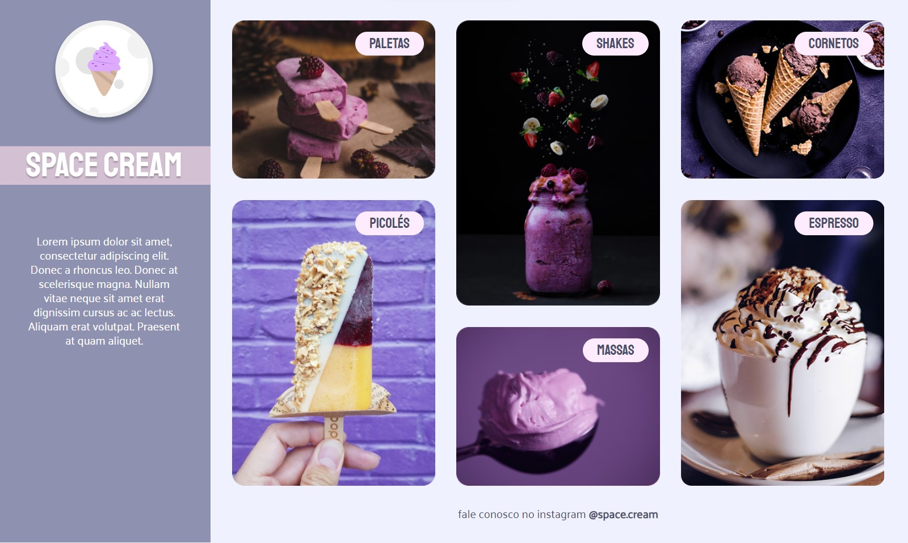
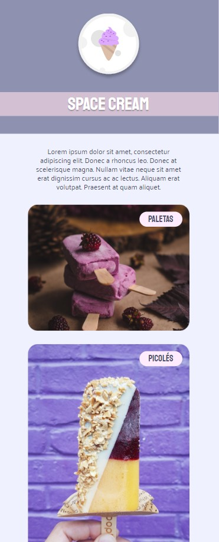

<h1 align="center">Responsive page with animation</h1>

<strong>PT-BR</strong>: Página responsiva com animações

 

    

  

 

## 🚀 Technologies 
<strong>EN:</strong> This project was developed with the following technologies:

-----
<strong>PT-BR:</strong> Esse projeto foi desenvolvido com as seguintes tecnologias:

- HTML e CSS
- Git e Github
- Figma

 

## 📖 Project
<strong>EN:</strong> Project made in Rocketseat's course "Explorer".
The project was to turn this project: https://github.com/lidiabrentano/mobile-first RESPONSIVE! 
 
Therefore, there were some changes on the layout using: 'display: grid' for the desktop and tablet versions; media queries; animation of text and images; css variables and flexible measurement units. (It was requested to remove the footer from the mobile version).
 
The layout was sent via Figma.

----
<strong>PT-BR:</strong> Neste projeto transformei este outro projeto: https://github.com/lidiabrentano/mobile-first em formato RESPONSIVO!
 Para isso foram necessárias algumas alterações no código: Uso do 'display: grid' para as versões desktop e tablet; media queries, animações de imagens e textos, uso de variáveis e unidades de medida flexíveis. (Foi solicitada a remoção do rodapé na versão mobile).
 
O layout para consulta foi enviado através da plataforma Figma.
 
Projeto feito no curso Explorer da Rocketseat.
 
 
- Online project: https://lidiabrentano.github.io/responsive-page-01/
 

-----

By Lídia Brentano 💜
